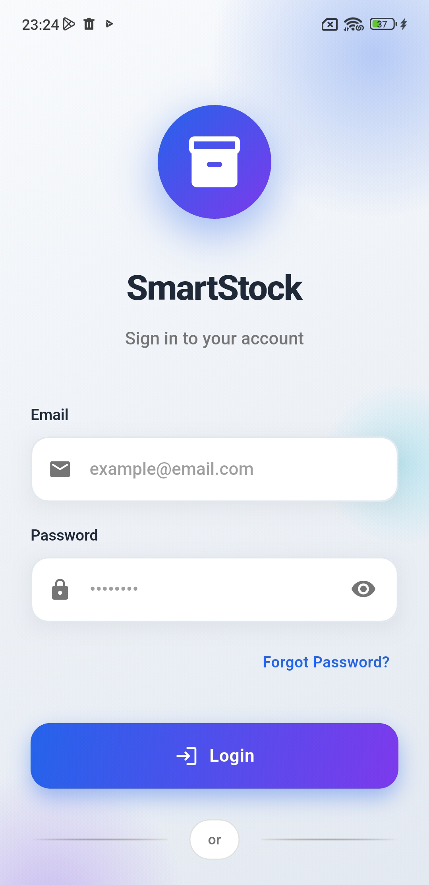
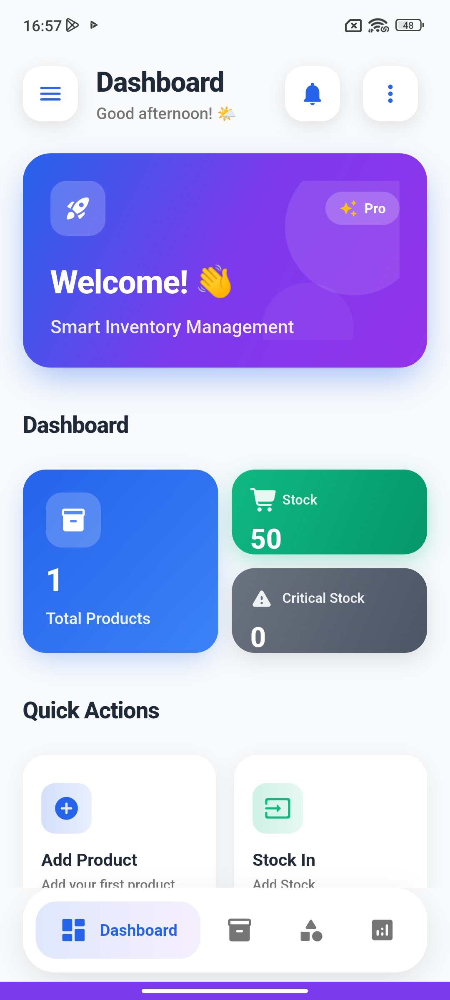

# 📦 SmartStock - Inventory Management System

<p align="center">
  
</p>

<p align="center">
  <a href="#features">Features</a> •
  <a href="#screenshots">Screenshots</a> •
  <a href="#installation">Installation</a> •
  <a href="#configuration">Configuration</a> •
  <a href="#usage">Usage</a> •
  <a href="#support">Support</a>
</p>

<p align="center">
  
  
  
  
</p>

---

## 🌟 Overview

**SmartStock** is a powerful, modern, and feature-rich inventory management application built with Flutter. Perfect for small to medium businesses, retail stores, warehouses, and anyone who needs to track their stock efficiently.

### Why SmartStock?

- ✅ **Beautiful UI/UX** - Modern Material 3 design with dark/light themes
- ✅ **Offline First** - Works without internet, syncs when connected
- ✅ **Barcode Scanner** - Quick product lookup with camera
- ✅ **Multi-language** - English and Turkish support
- ✅ **Export Reports** - PDF and Excel export functionality
- ✅ **Cloud Backup** - Firebase integration for data safety
- ✅ **Cross-Platform** - Android and iOS support

---

## ✨ Features

### 📱 Product Management
- Add, edit, and delete products
- Product images support
- Barcode/QR code scanning
- Category and brand organization
- Stock level tracking
- Purchase and sale price management

### 📊 Dashboard & Analytics
- Real-time stock overview
- Critical stock alerts
- Recent products list
- Quick action buttons
- Visual statistics

### 📁 Categories & Brands
- Unlimited categories
- Brand management
- Easy organization

### 📈 Reports & Export
- Export to PDF (with Turkish character support)
- Export to Excel
- Database backup & restore
- Share reports via apps

### 🔐 Authentication
- Firebase Authentication
- Email/password login
- Offline mode support
- User profile management

### 🎨 Customization
- Light/Dark theme
- System theme auto-detection
- Currency settings
- Low stock threshold settings
- Notification preferences

### 🌍 Localization
- English language
- Turkish language (Türkçe)
- Easy to add more languages

---

## 📸 Screenshots

<p align="center">
  
  
  
  
</p>

<p align="center">
  
  
  
  
</p>

---

## 🛠 Installation

### Prerequisites

- Flutter SDK 3.19 or higher
- Dart SDK 3.3 or higher
- Android Studio / VS Code
- Firebase account (for authentication)

### Step 1: Extract the Package

```bash
unzip smartstock.zip
cd smartstock
```

### Step 2: Install Dependencies

```bash
flutter pub get
```

### Step 3: Configure Firebase

1. Go to [Firebase Console](https://console.firebase.google.com/)
2. Create a new project or use existing one
3. Add Android app with your package name
4. Download `google-services.json`
5. Place it in `android/app/` directory
6. Add iOS app (if needed)
7. Download `GoogleService-Info.plist`
8. Place it in `ios/Runner/` directory

> 📖 See [FIREBASE_SETUP.md](docs/FIREBASE_SETUP.md) for detailed instructions

### Step 4: Run the App

```bash
# For Android
flutter run

# For iOS
cd ios && pod install && cd ..
flutter run
```

### Step 5: Build for Production

```bash
# Android APK
flutter build apk --release

# Android App Bundle (for Play Store)
flutter build appbundle --release

# iOS
flutter build ios --release
```

---

## ⚙️ Configuration

### Changing App Name

1. **Android**: Edit `android/app/src/main/AndroidManifest.xml`
```xml
android:label="Your App Name"
```

2. **iOS**: Edit `ios/Runner/Info.plist`
```xml
<key>CFBundleName</key>
<string>Your App Name</string>
```

### Changing Package Name

Use the `change_app_package_name` package:
```bash
flutter pub add change_app_package_name --dev
flutter pub run change_app_package_name:main com.yourcompany.yourapp
```

### Changing App Icon

1. Place your icon in `assets/icon/` directory
2. Update `pubspec.yaml`:
```yaml
flutter_icons:
  android: true
  ios: true
  image_path: "assets/icon/app_icon.png"
```
3. Run:
```bash
flutter pub run flutter_launcher_icons:main
```

### Adding New Languages

1. Create new locale file in `lib/l10n/`
2. Add translations
3. Update `lib/l10n/app_localizations.dart`

---

## 📁 Project Structure

```
lib/
├── main.dart              # App entry point
├── app.dart               # App configuration
├── routes.dart            # Navigation routes
├── l10n/                  # Localization files
│   ├── app_localizations.dart
│   ├── app_en.dart        # English translations
│   └── app_tr.dart        # Turkish translations
├── models/                # Data models
│   ├── product.dart
│   ├── category.dart
│   ├── brand.dart
│   └── ...
├── providers/             # State management
│   ├── product_provider.dart
│   ├── category_provider.dart
│   ├── settings_provider.dart
│   └── ...
├── screens/               # UI screens
│   ├── dashboard_screen.dart
│   ├── products/
│   ├── login_screen.dart
│   └── ...
├── services/              # Business logic
│   ├── db_helper.dart
│   └── export_service.dart
├── utils/                 # Utilities
│   ├── constants.dart
│   └── app_icons.dart
└── widgets/               # Reusable widgets
    ├── premium_widgets.dart
    ├── product_card.dart
    └── ...
```

---

## 🔧 Tech Stack

| Technology | Purpose |
|------------|---------|
| Flutter 3.19+ | Cross-platform framework |
| Provider | State management |
| SQLite (sqflite) | Local database |
| Firebase Auth | Authentication |
| Cloud Firestore | Cloud backup (optional) |
| mobile_scanner | Barcode scanning |
| pdf & printing | PDF generation |
| excel | Excel export |
| shared_preferences | Local settings |

---

## 📝 Changelog

### Version 1.0.0 (Initial Release)
- ✅ Product management (CRUD)
- ✅ Category & brand management
- ✅ Stock tracking with history
- ✅ Barcode/QR scanner
- ✅ Firebase authentication
- ✅ PDF & Excel export
- ✅ Database backup & restore
- ✅ Dark/Light theme
- ✅ English & Turkish language
- ✅ Modern Material 3 UI

---

## 🆘 Support

### Documentation
- [Firebase Setup Guide](docs/FIREBASE_SETUP.md)
- [Customization Guide](docs/CUSTOMIZATION.md)
- [FAQ](docs/FAQ.md)

### Getting Help
If you have questions or need support:
1. Check the documentation first
2. Review closed issues for similar problems
3. Contact support via CodeCanyon

### Reporting Bugs
When reporting bugs, please include:
- Device model and OS version
- Flutter version (`flutter --version`)
- Steps to reproduce
- Expected vs actual behavior
- Screenshots if applicable

---

## 📄 License

This project is licensed under the CodeCanyon Regular License. You can:
- ✅ Use for a single end product
- ✅ Use for personal or client project
- ❌ Resell or redistribute the source code
- ❌ Use in multiple projects (requires extended license)

See [LICENSE](LICENSE) for full details.

---

## 🙏 Credits

- [Flutter](https://flutter.dev) - Google's UI toolkit
- [Firebase](https://firebase.google.com) - Backend services
- [Material Design 3](https://m3.material.io) - Design system
- Icons by [Font Awesome](https://fontawesome.com)

---

<p align="center">
  Made with ❤️ using Flutter
</p>

<p align="center">
  <strong>Thank you for purchasing SmartStock!</strong>
</p>
